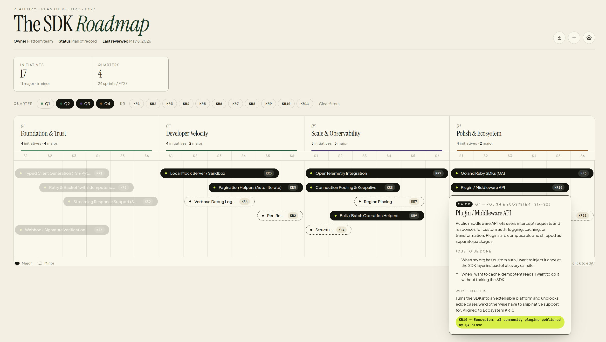

# Lanes

A single-file, drag-and-drop roadmap visualizer. Open `Roadmap.html`, import a JSON file, and you have an editable timeline across four stages with hover detail, KR filtering, and sprint-level granularity.

Built to be portable — no build step, no server, no framework. Just three files (`Roadmap.html`, `app.js`, `styles.css`) and a JSON roadmap.

## Quick start

1. Open `Roadmap.html` in a browser.
2. Click the import icon (↓) top-right, or drag a roadmap JSON onto the page.
3. Drag cards to move them, drag edges to resize, hover for detail, click to edit.

A starter `data.js` is included if you want to see the SDK roadmap example. It's optional — the page boots empty without it.

## What's on the page

- **24-sprint timeline** — 4 stages × 6 sprints each. Cards snap to sprint boundaries and can span across stages.
- **Drag to move, drag edges to resize.** Vertical drag changes lane.
- **Hover popover** with full description, JTBDs, value statement, and KR alignment.
- **KPI strip** at the top: stage counts and majors/minors.
- **Filter rail** — multi-select chips for stages and KRs. Within a category results are OR-ed; across categories they're AND-ed.
- **Settings cog** (top-right) — rename stages, edit any initiative, change look (variant, palette), edit masthead meta (title, FY, owner, status).
- **Add (+)** to create a new initiative; cards can be edited or deleted from the modal.
- **Export / Import / Reset** in the settings panel; everything persists to `localStorage`.

## Roadmap JSON shape

```json
{
  "meta": {
    "title": "The SDK Roadmap",
    "fy": "FY26",
    "eyebrow": "Platform · plan of record",
    "owner": "Platform team",
    "status": "Plan of record",
    "lastReviewed": "May 8, 2026",
    "show": { "title": true, "fy": true, "owner": true, "status": true, "lastReviewed": true, "stageNames": true }
  },
  "quarters": ["Q1 — Foundation", "Q2 — Velocity", "Q3 — Scale", "Q4 — Polish"],
  "features": [
    {
      "id": "f1",
      "title": "Typed Client Generation",
      "type": "major",
      "q": 0,
      "start": 0,
      "length": 4,
      "lane": 0,
      "description": "Two sentences describing what ships and why it matters.",
      "jtbds": ["When I integrate the API, I want autocomplete so I don't ship broken calls."],
      "value": "Outcome sentence. KR alignment sentence.",
      "kr": "KR1 — Activation: TTFHW < 10 min"
    }
  ]
}
```

### Constraints

- `quarters` must have **exactly 4** entries.
- Total timeline = **24 sprints** (`start` 0–23, 6 sprints per stage).
- A feature spans `[start, start + length)`. Must satisfy `start + length ≤ 24`.
- `q` is the stage where the feature **starts** (0–3). It's allowed to span across stages.
- `type` is `"major"` or `"minor"`. Minors render with a dashed border.
- `lane` is zero-indexed; lanes grow as needed and compact on save.
- `id` is unique. Use `f1, f2, ...` or any stable string.

Anything missing on import gets a sensible default (empty strings, empty arrays, lane 0). The validator clamps out-of-range values rather than rejecting the file.

## Populating from scratch

If you have Claude Code, drop into the project and use the bundled skill:

```
/roadmap-populate
```

It walks you through meta, stage names, and per-stage features (2–3 majors + 1–2 minors), runs greedy lane packing, and writes a valid `roadmap.json` ready to import.

The skill is at `.claude/skills/roadmap-populate/SKILL.md` if you want to inspect or tweak the prompts.

## Files

| File | Purpose |
|---|---|
| `Roadmap.html` | Markup, settings panel, edit modal, drop overlay |
| `app.js` | State, render, drag/resize, popover, filters, import/export |
| `styles.css` | Layout, card variants (editorial / strata / index), palettes |
| `data.js` | Optional sample roadmap (SDK example). Safe to delete. |
| `screen.png` | This README's header image |

## Design choices worth knowing

- **No framework, no build.** Single HTML file + plain JS + CSS. Open it from disk; works offline.
- **Self-contained boot.** `app.js` ships with empty fallbacks so the page works even if `data.js` is absent — that's what makes it portable as a template.
- **localStorage persists everything.** Reset (in settings) restores from `window.DEFAULT_DATA` if loaded, otherwise an empty roadmap.
- **Filters are visual, not destructive.** Selecting filter chips dims non-matching cards rather than hiding them, so the timeline shape stays legible.
- **Lanes auto-compact on drop.** Drag a card past the bottom and a new lane appears; release on an empty lane and unused lanes collapse.

## Customizing the look

The settings cog → **Look** has two controls:

- **Style (variant)** — `editorial` (airy, default), `strata` (banded quarters), `index` (detail-rich cards)
- **Palette** — `cream`, `bone`, `sage`

Density, KR badges, and quarter color themes are baked into the `<body data-*>` attributes if you want to flip them. Defaults: `density="default"`, `quarterThemes=true`, `showKR=true`.
